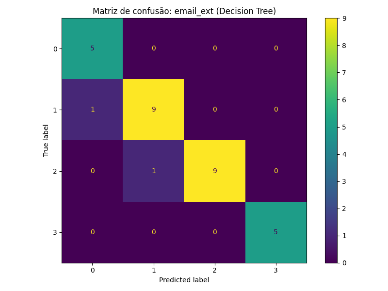
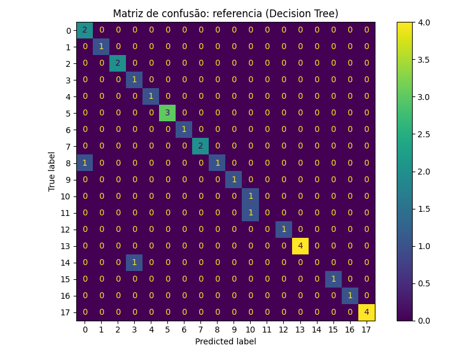
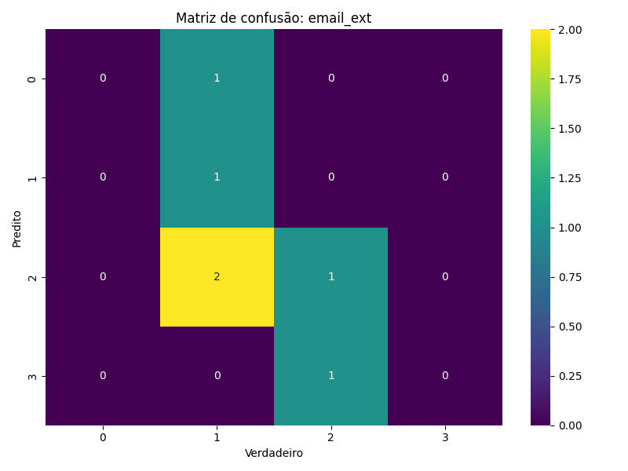
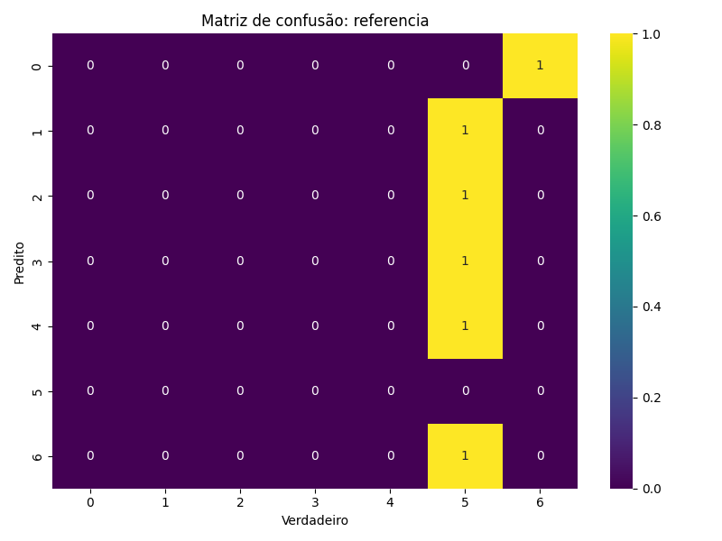
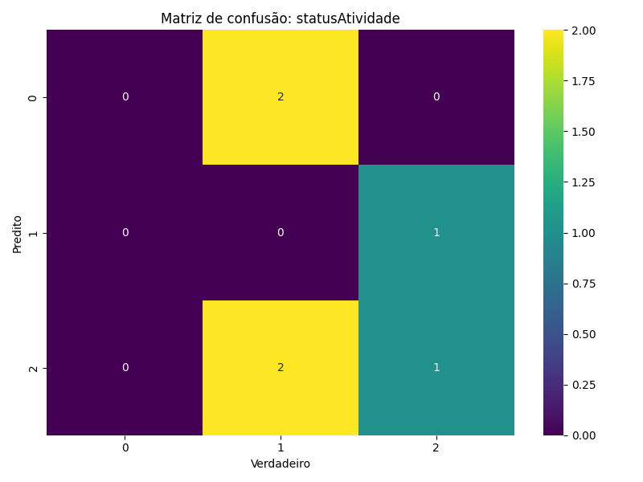
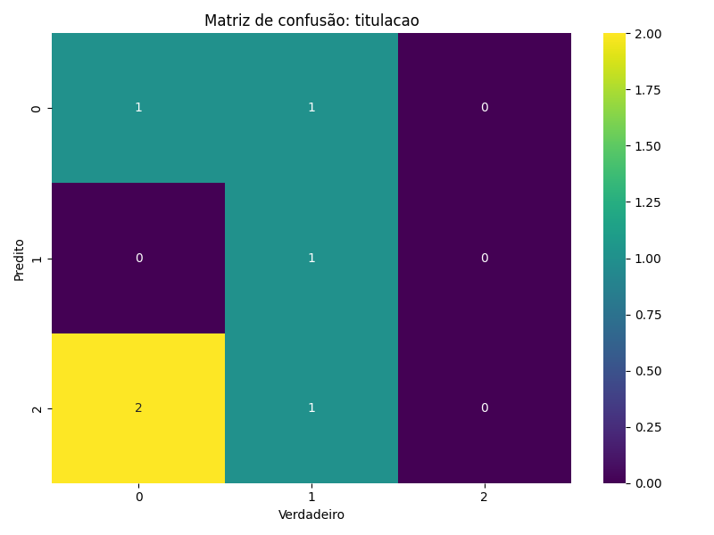

# 📚 API de Cadastro Inteligente de Professores

Esta API realiza o cadastro inteligente de professores, prevendo e completando automaticamente campos com base em informações parciais fornecidas pelo usuário. Utiliza modelos de **Machine Learning** — Árvore de Decisão e Rede Neural — treinados com dados reais para oferecer sugestões confiáveis e consistentes.

---

## 🚀 Funcionalidades

- **`/predict/full`**: Retorna todos os campos previstos de um professor.
- **`/predict/partial`**: Recebe um JSON com informações parciais e retorna os campos faltantes previstos automaticamente.
- **`/train`**: Re-treina todos os modelos de Machine Learning e gera relatórios de desempenho.
- **Geração automática de relatórios**: Salva métricas e matrizes de confusão em `/docs`.
- **Geração única de e-mail e Lattes**: Cria e-mail e link Lattes exclusivos baseados no nome.
- **Autenticação via API Key**: Todas as rotas são protegidas por chave de API.
- **Re-treinamento automático**: O sistema verifica periodicamente a necessidade de re-treinamento.

---

## 🧠 Pipeline de Funcionamento

1. **Pré-processamento**: Carregamento de dados do banco ou CSV.
2. **Treinamento**: Modelos de Árvore de Decisão e Rede Neural são treinados para cada campo.
3. **Relatórios**: Relatórios de desempenho e matrizes de confusão são salvos.
4. **Predição**: Campos ausentes são inferidos com base nos modelos treinados.
5. **Geração de E-mail e Lattes**: Criação única baseada no nome e domínio.
6. **Retorno Estruturado**: O retorno segue o modelo completo, omitindo campos já fornecidos.

---

## 🛠️ Como Utilizar

### 1. Clone o repositório

```bash
git clone <URL_DO_REPOSITORIO>
cd projeto-cadastro-ml-api
```

### 2. Crie e ative o ambiente virtual

```bash
python -m venv .venv
# Windows
.venv\Scripts\activate
# Linux/Mac
source .venv/bin/activate
```

### 3. Instale as dependências

```bash
pip install -r requirements.txt
```

### 4. Configure o arquivo `.env`

```bash
cp .env-exemplo .env
```

Preencha com:
- Configurações do banco de dados
- Sua `API_KEY`

### 5. Treine os modelos (opcional)

```bash
python main.py
# ou
uvicorn src.app:app --reload
```

### 6. Execute a API

```bash
uvicorn src.app:app --reload
```

---

## 📬 Exemplo de Requisição

**POST /predict/partial**

```http
Headers:
apikey: <SUA_API_KEY>
```

```json
{
  "nome": "Maria Silva",
  "titulacao": "DOUTOR"
}
```

**Resposta:**

```json
{
  "email_ext": "gmail.com",
  "referencia": "PES_I_D",
  "statusAtividade": "LICENCA",
  "email": "maria.silva@gmail.com",
  "lattes": "https://lattes.com.br/mariasilva"
}
```

---

## 📂 Estrutura de Pastas

```
├── src/
├── docs/
│   ├── confusion_matrix/
│   │   ├── decision_tree/
│   │   └── neural_network/
│   ├── comparativo.txt
│   └── reports/
├── modelos_treinados/
├── logs/
├── .env
├── requirements.txt
└── README.md
```

---

## 📊 Desempenho dos Modelos

### Árvore de Decisão

<table>
  <tr>
    <td>
      <p><strong>Email</strong></p>
      
    </td>
    <td>
      <p><strong>Referência</strong></p>
      
    </td>
  </tr>
</table>

### Rede Neural

<table>
  <tr>
    <td>
      <p><strong>Email</strong></p>
      
    </td>
    <td>
      <p><strong>Referência</strong></p>
      
    </td>
  </tr>
  <tr>
    <td>
      <p><strong>Status Atividade</strong></p>
      
    </td>
    <td>
      <p><strong>Titulação</strong></p>
      
    </td>
  </tr>
</table>

---

## 🏆 Escolha do Melhor Modelo com Base na Acurácia

Durante o processo de treinamento, a API treina dois tipos de modelos para cada campo: **Árvore de Decisão** e **Rede Neural**. O modelo com **maior acurácia** no conjunto de validação é automaticamente selecionado para a predição de cada campo.

Os resultados comparativos de desempenho entre os modelos são salvos em:

```
/docs/comparativo.txt
```

Esse arquivo contém um resumo detalhado de acurácia, precisão, recall e F1-score de cada modelo por campo previsto. Com base nesses dados, a API escolhe dinamicamente qual modelo usar para cada campo.

### 📄 Exemplo de conteúdo do `comparativo.txt`

```txt
titulacao:
  Melhor modelo: decision_tree
  Acurácia NN: 0.8333
  Acurácia DT: 0.9000

email_ext:
  Melhor modelo: decision_tree
  Acurácia NN: 0.7667
  Acurácia DT: 0.9333

referencia:
  Melhor modelo: decision_tree
  Acurácia NN: 0.6667
  Acurácia DT: 0.9000

statusAtividade:
  Melhor modelo: decision_tree
  Acurácia NN: 0.8000
  Acurácia DT: 0.9000
```

### 📄 Exemplo de conteúdo do `email_ext.txt` da `Árvore de Decisão`

```txt
Árvore de Decisão:

Características do Modelo: Tipo: DecisionTreeClassifier
Desempenho: Acurácia: 0.9333, Precisão: 0.9389, Recall: 0.9333, F1: 0.9340
Importância das Variáveis: (não extraído)
Análise de Overfitting/Underfitting: Comparar erro de treino/teste
Tempo de Treinamento: (Não registrado)

Matriz de Confusão: [
[5, 0, 0, 0],
[1, 9, 0, 0],
[0, 1, 9, 0],
[0, 0, 0, 5]]

```
### 📄 Exemplo de conteúdo do `email_ext.txt` da `Rede Neural`

```txt
Rede Neural:

Arquitetura do Modelo: [64, 32, 4]
Hiperparâmetros: Otimizador: Adam, Função de Ativação: ReLU, Épocas: 50, Batch: 8
Desempenho: Acurácia: 0.7667, Precisão: 0.8397, Recall: 0.7667, F1: 0.7674
Análise de Overfitting/Underfitting: Verificar matriz de confusão
Tempo de Treinamento: (Não registrado)

Matriz de Confusão: [
[3, 1, 0, 1],
[0, 10, 0, 0],
[0, 1, 6, 3],
[0, 1, 0, 4]]
```
---

## 🔐 Segurança

Todas as rotas são protegidas com autenticação via **API Key**. Inclua no header de todas as requisições:

```
apikey: <SUA_API_KEY>
```

---

## 📅 Agendamento Automático

O sistema verifica automaticamente, em intervalos periódicos, se há necessidade de re-treinar os modelos com novos dados, garantindo predições sempre atualizadas.

---

## 🧪 Tecnologias Utilizadas

- **FastAPI**
- **Scikit-learn**
- **Keras/TensorFlow**
- **Pandas & NumPy**
- **Uvicorn**
- **dotenv**

---

## 📌 Observações

- Modelos são re-treinados automaticamente se necessário.
- Matrizes de confusão e relatórios são salvos na pasta `/docs`.
- E-mails e links Lattes são garantidamente únicos.
- Compatível com Postman, Insomnia, curl, etc.

---

## 🤝 Contribuição

Contribuições são bem-vindas! Sinta-se à vontade para abrir issues ou enviar pull requests.

---

## 📄 Licença

Licenciado sob a [MIT License](LICENSE).