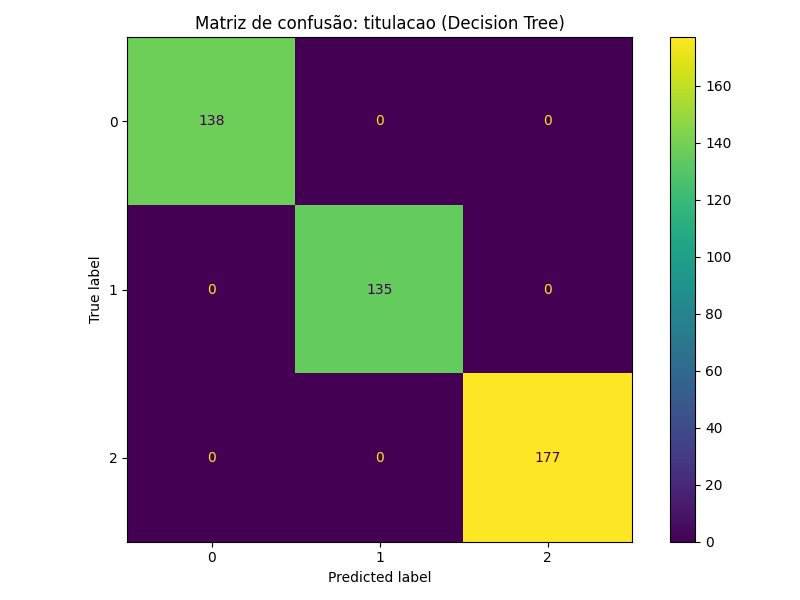
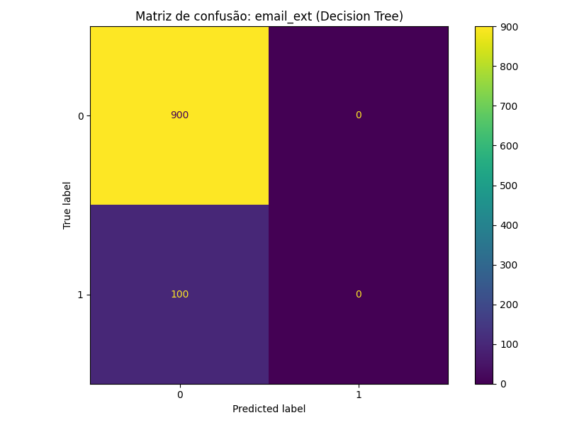
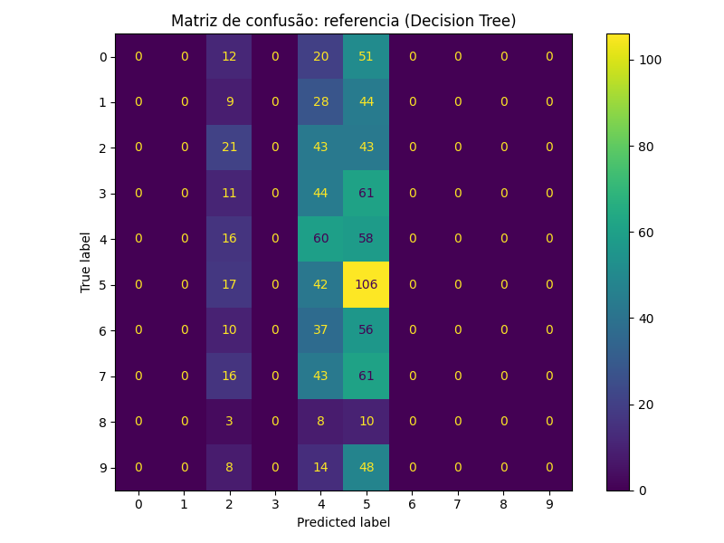
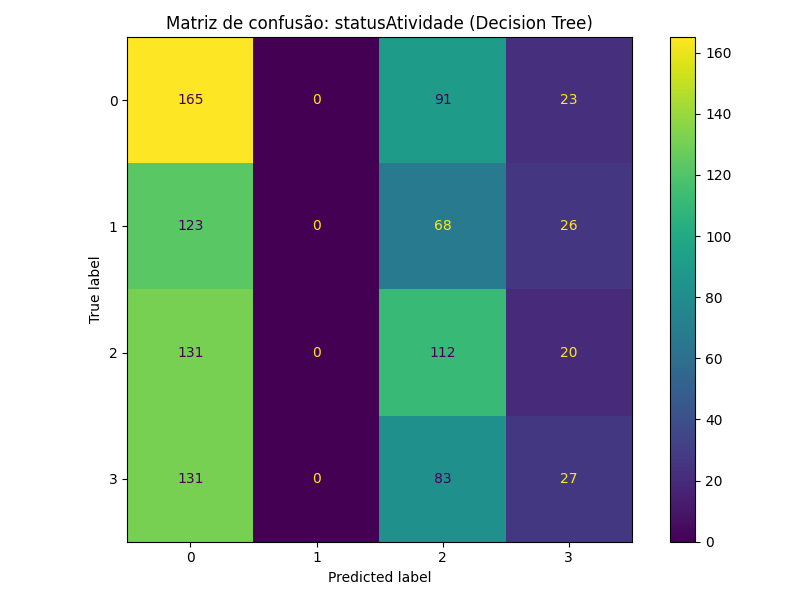
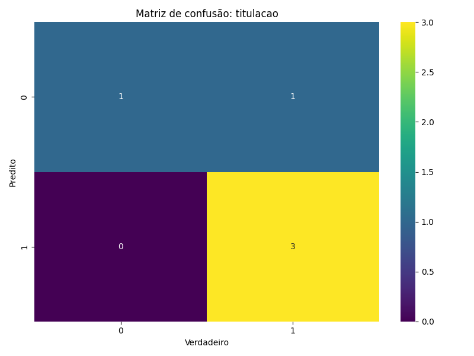
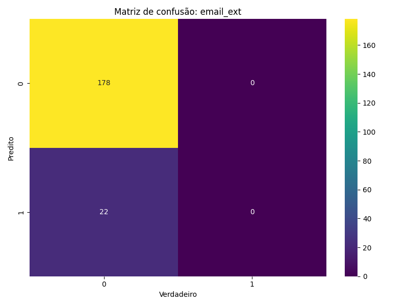
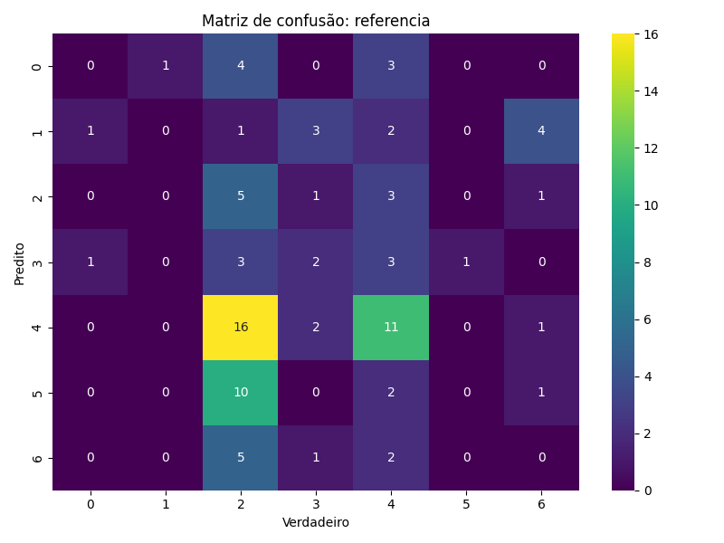
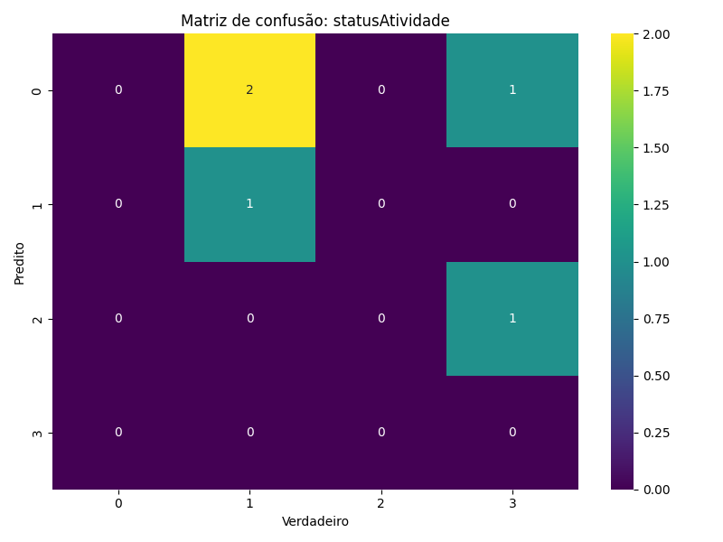

# 🎓 Sistema Inteligente de Predição de Atributos de Professores Universitários

## Resumo Executivo

Este sistema implementa uma API baseada em Machine Learning para predição automática de atributos de professores universitários, utilizando uma arquitetura híbrida que combina algoritmos de aprendizado supervisionado (Árvores de Decisão e Redes Neurais Artificiais) com métodos estatísticos para geração de dados sintéticos realistas. O sistema oferece capacidades de predição completa e parcial, com re-treinamento automático baseado em métricas de drift de dados.

---

## 🔬 Metodologia e Pipeline de Machine Learning

### 1. Arquitetura do Sistema de Aprendizado

O sistema implementa uma arquitetura multi-modelo com duas estratégias distintas de predição:

#### 1.1 Modelos Completos (Full Prediction)
- **Objetivo**: Predição de todos os atributos categóricos a partir de features de entrada
- **Campos Alvo**: `titulacao`, `email_ext`, `referencia`, `statusAtividade`
- **Algoritmos**: Decision Tree Classifier e Multi-Layer Perceptron (MLP)
- **Estratégia de Seleção**: Comparação de métricas de performance com seleção automática do melhor modelo

#### 1.2 Modelos Parciais (Partial Prediction)
- **Objetivo**: Predição de atributos faltantes baseada em atributos conhecidos
- **Configurações**: 6 modelos especializados para diferentes cenários de dados ausentes
- **Metodologia**: Treinamento específico para cada combinação de features disponíveis

### 2. Pré-processamento e Engenharia de Features

#### 2.1 Extração e Transformação de Dados
```python
# Pipeline de pré-processamento implementado em src/services/preprocessing.py
def preprocess_for_decision_tree(df: pd.DataFrame, save_dir: str) -> dict:
    # Extração da extensão do email como feature categórica
    df["email_ext"] = df["email"].apply(extract_email_extension)
    
    # Encoding de variáveis categóricas usando One-Hot Encoding
    X = pd.get_dummies(df.drop(columns=targets))
    
    # Label Encoding para variáveis target
    for target in targets:
        le = LabelEncoder()
        y_encoded = le.fit_transform(df[target])
```

#### 2.2 Normalização para Redes Neurais
- **Conversão de Tipos**: Float32 para otimização computacional
- **Encoding Categórico**: One-Hot Encoding para features, Categorical Encoding para targets
- **Padronização**: Aplicação de transformações consistentes entre treino e predição

### 3. Arquiteturas dos Modelos de Machine Learning

#### 3.1 Decision Tree Classifier
- **Algoritmo**: CART (Classification and Regression Trees)
- **Critério de Divisão**: Gini Impurity
- **Vantagens**: Interpretabilidade, robustez a outliers, não requer normalização
- **Implementação**: Scikit-learn DecisionTreeClassifier com parâmetros padrão

#### 3.2 Multi-Layer Perceptron (Rede Neural)
```python
# Arquitetura padrão implementada em src/services/train_nn.py
model = Sequential([
    Dense(64, activation="relu", input_shape=(X.shape[1],)),  # Camada oculta 1
    Dense(32, activation="relu"),                            # Camada oculta 2
    Dense(y_cat.shape[1], activation="softmax")             # Camada de saída
])
```

**Hiperparâmetros Configurados**:
- **Otimizador**: Adam (adaptive moment estimation)
- **Função de Perda**: Categorical Crossentropy
- **Épocas**: 50 (com early stopping implícito)
- **Batch Size**: 8 (otimizado para datasets pequenos)
- **Função de Ativação**: ReLU (Rectified Linear Unit)
- **Ativação de Saída**: Softmax (probabilidades categóricas)

### 4. Metodologia de Avaliação e Seleção de Modelos

#### 4.1 Métricas de Performance
O sistema calcula as seguintes métricas para cada modelo:

- **Acurácia**: Proporção de predições corretas
- **Precisão**: Média ponderada da precisão por classe
- **Recall**: Média ponderada do recall por classe  
- **F1-Score**: Média harmônica entre precisão e recall
- **Matriz de Confusão**: Análise detalhada de erros por classe

#### 4.2 Processo de Seleção Automática
```python
# Implementado em src/services/generate_model_reports.py
melhor = "neural_network" if nn["accuracy"] >= arv["accuracy"] else "decision_tree"
```

O sistema seleciona automaticamente o modelo com maior acurácia para cada campo, gerando relatórios comparativos em `/docs/comparativo.txt`.

### 5. Modelos Parciais Especializados

#### 5.1 Cenários de Predição Parcial
O sistema treina 6 modelos especializados para diferentes configurações de dados ausentes:

**Modelos para 1 campo faltante**:
- `parcial_titulacao.pkl`: Prediz titulação baseada em referência e status
- `parcial_referencia.pkl`: Prediz referência baseada em titulação e status  
- `parcial_statusAtividade.pkl`: Prediz status baseado em titulação e referência

**Modelos para 2 campos faltantes**:
- `parcial_titulacao_referencia.pkl`: Prediz titulação e referência baseado apenas em status
- `parcial_titulacao_statusAtividade.pkl`: Prediz titulação e status baseado apenas em referência
- `parcial_referencia_statusAtividade.pkl`: Prediz referência e status baseado apenas em titulação

#### 5.2 Algoritmo de Fallback Estatístico
Quando nenhum campo de ML é fornecido, o sistema utiliza um algoritmo estatístico baseado em distribuições empíricas:

```python
# Implementado em src/utils/statistics.py
def get_top3_random(campo):
    """Seleção estocástica entre os 3 valores mais frequentes"""
    contagem = df[campo].value_counts()
    top3 = contagem.head(3).index.tolist()
    return random.choice(top3)
```

Este método garante:
- **Realismo**: Baseado em distribuições reais do dataset
- **Variabilidade**: Evita respostas determinísticas
- **Representatividade**: Mantém a distribuição estatística dos dados

---

## 📊 Documentação e Relatórios de Performance

### 1. Estrutura da Documentação

O sistema gera automaticamente documentação detalhada em `/docs/`:

```
docs/
├── comparativo.txt                    # Relatório comparativo de modelos
├── confusion_matrix/                  # Matrizes de confusão visuais
│   ├── decision_tree/                # Matrizes para árvores de decisão
│   └── neural_network/               # Matrizes para redes neurais
├── decision_tree/                    # Relatórios detalhados - Decision Trees
│   ├── titulacao.txt
│   ├── email_ext.txt
│   ├── referencia.txt
│   └── statusAtividade.txt
└── neural_network/                   # Relatórios detalhados - Neural Networks
    ├── titulacao.txt
    ├── email_ext.txt
    ├── referencia.txt
    └── statusAtividade.txt
```

### 2. Conteúdo dos Relatórios

Cada relatório individual contém:

#### 2.1 Para Redes Neurais
- **Arquitetura Detalhada**: Número de neurônios por camada
- **Hiperparâmetros**: Otimizador, funções de ativação, épocas, batch size
- **Métricas de Performance**: Acurácia, precisão, recall, F1-score
- **Análise de Overfitting/Underfitting**: Baseada na matriz de confusão
- **Matriz de Confusão Numérica**: Para análise quantitativa detalhada

#### 2.2 Para Árvores de Decisão
- **Características do Modelo**: Tipo e configuração do classificador
- **Métricas de Performance**: Métricas completas de classificação
- **Análise de Complexidade**: Discussão sobre overfitting vs underfitting
- **Interpretabilidade**: Notas sobre a capacidade explicativa do modelo

### 3. Matrizes de Confusão Visuais

O sistema gera matrizes de confusão visuais para todos os modelos, salvas em `/docs/confusion_matrix/`. Estas visualizações utilizam:
- **Colormap**: Viridis para máximo contraste
- **Anotações**: Valores numéricos sobrepostos
- **Normalização**: Valores absolutos para interpretação direta
- **Formatação**: PNG com alta resolução para análise detalhada

---

## 🔍 Visualização das Matrizes de Confusão

### Decision Tree - Matrizes de Confusão

<div align="center">

| **Titulação** | **Email Extension** |
|:---:|:---:|
|  |  |

| **Referência** | **Status Atividade** |
|:---:|:---:|
|  |  |

</div>

### Neural Network - Matrizes de Confusão

<div align="center">

| **Titulação** | **Email Extension** |
|:---:|:---:|
|  |  |

| **Referência** | **Status Atividade** |
|:---:|:---:|
|  |  |

</div>

---

## 🗃️ Sistema de Geração de Dados: inserir_professores_fake.py

### 1. Visão Geral do Módulo

O arquivo `inserir_professores_fake.py` é responsável pela geração de dados sintéticos realistas para treinamento dos modelos de Machine Learning. Este módulo implementa algoritmos probabilísticos que simulam distribuições reais de atributos acadêmicos, garantindo que os dados gerados mantenham as correlações e padrões observados em ambientes universitários reais.

### 2. Estrutura de Dados e Configurações

#### 2.1 Bases de Dados Linguísticos
```python
# Leitura de arquivos de nomes reais brasileiros
NOMES_FEMININOS = ler_nomes_arquivo("src/resources/nomes_femininos.txt")  # ~100 nomes
NOMES_MASCULINOS = ler_nomes_arquivo("src/resources/nomes_masculinos.txt") # ~100 nomes  
SOBRENOMES = ler_nomes_arquivo("src/resources/sobrenomes.txt")           # ~100 sobrenomes
```

#### 2.2 Configurações Institucionais
```python
UNIDADES = ["003", "301", "132", "131", "174", "178", "112", "265", "299"]  # Códigos de unidades FATEC
REFERENCIAS = ["PES_I_A", "PES_II_A", "PES_III_A", ..., "PES_III_H"]        # 24 níveis hierárquicos
STATUS = ["ATIVO", "AFASTADO", "LICENCA", "NAO_ATIVO"]                      # Estados de atividade
```

### 3. Distribuições Probabilísticas

#### 3.1 Distribuição de Titulação
```python
TITULACAO_DISTRIB = {
    "DOUTOR": 0.15,        # 15% - Reflete realidade acadêmica
    "MESTRE": 0.60,        # 60% - Maioria dos professores
    "ESPECIALISTA": 0.25   # 25% - Professores técnicos
}
```

#### 3.2 Distribuição de Domínio de Email
```python
EMAIL_DISTRIB = {
    "@fatec.sp.gov.br": 0.9,  # 90% - Email institucional oficial
    "@gmail.com": 0.1         # 10% - Email alternativo/temporário
}
```

### 4. Algoritmo de Correlação Hierárquica: Referência por Titulação

#### 4.1 Metodologia de Distribuição
O sistema implementa distribuições probabilísticas específicas que correlacionam titulação acadêmica com progressão de carreira:

```python
REFERENCIA_DISTRIB = {
    "DOUTOR": [
        (0.05, 26),  # 5% PES_III_H (topo da carreira)
        (0.15, 23),  # 10% PES_III_G
        (0.30, 20),  # 15% PES_III_F
        (0.50, 17),  # 20% PES_III_E
        (0.70, 14),  # 20% PES_III_D
        (0.85, 11),  # 15% PES_III_C
        (0.95, 8),   # 10% PES_III_B
        (1.00, 5)    # 5% PES_III_A (início carreira doutoral)
    ]
}
```

#### 4.2 Interpretação da Distribuição
- **Probabilidade Cumulativa**: Valores crescentes de 0.05 a 1.00
- **Índices de Referência**: Mapeamento para array REFERENCIAS[]
- **Lógica Hierárquica**: Doutores concentrados em níveis PES_III (mais altos)
- **Realismo Acadêmico**: Poucos professores no topo da carreira, distribuição gaussiana

#### 4.3 Algoritmo de Seleção de Referência
```python
def sortear_referencia(titulacao):
    """
    Algoritmo de seleção baseado em distribuição cumulativa
    Garante correlação realística entre titulação e progressão de carreira
    """
    dist = REFERENCIA_DISTRIB[titulacao]
    r = random.random()  # Valor aleatório [0,1)
    
    for probabilidade_cumulativa, indice_referencia in dist:
        if r <= probabilidade_cumulativa:
            return REFERENCIAS[min(indice_referencia, len(REFERENCIAS)-1)]
    
    return REFERENCIAS[0]  # Fallback
```

### 5. Algoritmos de Geração de Identidade

#### 5.1 Geração de Nomes Compostos
```python
def gerar_nome_completo():
    """
    Seleção equiprobável entre nomes femininos e masculinos
    Combinação aleatória com sobrenomes brasileiros
    """
    if random.random() < 0.5:
        nome = random.choice(NOMES_FEMININOS)
    else:
        nome = random.choice(NOMES_MASCULINOS)
    sobrenome = random.choice(SOBRENOMES)
    return f"{nome} {sobrenome}"
```

#### 5.2 Geração de Email com Sufixo Único
```python
def gerar_email(nome, dominio):
    """
    Normalização do nome (minúsculas, sem espaços)
    Adição de sufixo numérico para garantir unicidade
    """
    base = nome.lower().replace(" ", "")
    return f"{base}{random.randint(100,999)}{dominio}"
```

#### 5.3 Geração de URL Lattes Sintética
```python
def gerar_lattes():
    """
    Simula estrutura real do CNPq: 16 caracteres alfanuméricos
    Mantém formato padrão para validação de entrada
    """
    return f"https://lattes.cnpq.br/{''.join(random.choices('ABCDEFGHIJKLMNOPQRSTUVWXYZ0123456789', k=16))}"
```

### 6. Pipeline de Inserção no Banco de Dados

#### 6.1 Processo de Distribuição Estratificada
```python
def inserir_professores(qtd=None):
    # 1. Cálculo de quantidades por titulação
    qtd_doutor = int(qtd * TITULACAO_DISTRIB["DOUTOR"])
    qtd_mestre = int(qtd * TITULACAO_DISTRIB["MESTRE"])  
    qtd_especialista = qtd - qtd_doutor - qtd_mestre
    
    # 2. Criação de arrays estratificados
    titulacoes = (["DOUTOR"] * qtd_doutor +
                  ["MESTRE"] * qtd_mestre +
                  ["ESPECIALISTA"] * qtd_especialista)
    
    # 3. Embaralhamento para evitar padrões sequenciais
    random.shuffle(titulacoes)
```

#### 6.2 Algoritmo de Inserção
```python
for i in range(qtd):
    nome = gerar_nome_completo()
    email = gerar_email(nome, dominios[i])
    titulacao = titulacoes[i]
    id_unidade = random.choice(UNIDADES)
    referencia = sortear_referencia(titulacao)  # Correlação hierárquica
    lattes = gerar_lattes()
    status = random.choice(STATUS)
    observacoes = gerar_observacao()
    
    # Inserção SQL com prepared statements
    cursor.execute(INSERT_QUERY, (nome, email, titulacao, id_unidade, 
                                 referencia, lattes, status, observacoes))
```

### 7. Características Técnicas do Gerador

#### 7.1 Garantias de Qualidade
- **Unicidade de Email**: Sufixos numéricos aleatórios garantem emails únicos
- **Correlações Realísticas**: Titulação influencia distribuição de referência
- **Distribuição Controlada**: Proporções definidas para cada atributo
- **Variabilidade**: Randomização evita padrões determinísticos

#### 7.2 Configurabilidade
- **Quantidade Configurável**: Variável de ambiente `QTD_PROFESSORES`
- **Distribuições Modificáveis**: Constantes facilmente ajustáveis
- **Conexão de Banco**: Configuração via arquivo `.env`
- **Extensibilidade**: Estrutura modular para novos atributos

#### 7.3 Validação e Controle
- **Prepared Statements**: Proteção contra SQL injection
- **Tratamento de Erro**: Conexão de banco com fallback
- **Logging**: Confirmação de inserção com contagem
- **Transação Completa**: Commit único após todas as inserções

---

## 🤖 Algoritmos de Geração de Dados em Tempo Real

### 1. Geração de Nomes e Identidades

#### 1.1 Algoritmo de Geração de Nomes
```python
# Implementado em src/utils/name_generator.py
def gerar_nome_completo():
    """Algoritmo estocástico para geração de nomes realistas"""
    nomes = nomes_masculinos + nomes_femininos  # 200+ nomes reais
    sobrenomes = lista_sobrenomes               # 100+ sobrenomes reais
    return f"{random.choice(nomes)} {random.choice(sobrenomes)}"
```

**Base de Dados Linguística**:
- **Nomes Masculinos**: 100+ nomes brasileiros comuns
- **Nomes Femininos**: 100+ nomes brasileiros comuns  
- **Sobrenomes**: 100+ sobrenomes representativos da população brasileira

#### 1.2 Geração de Email Único
```python
def gerar_email_unico(nome, extensao):
    """Algoritmo de geração de email com verificação de unicidade"""
    base = remover_acentos(nome).replace(" ", ".").lower()
    emails_existentes = load_professores()["email"].tolist()
    
    candidato = f"{base}@{extensao}"
    i = 1
    while candidato in emails_existentes:
        candidato = f"{base}{i}@{extensao}"
        i += 1
    return candidato
```

**Características**:
- **Unicidade Garantida**: Verificação contra base de dados existente
- **Normalização**: Remoção de acentos e padronização
- **Incremento Automático**: Sufixos numéricos para resolução de conflitos

#### 1.3 Geração de URLs Lattes
Sistema de geração de URLs do Currículo Lattes sintéticas baseadas no nome do professor, mantendo formato consistente com o padrão CNPq.

### 2. Algoritmos Estatísticos para Predição

#### 2.1 Algoritmo de Seleção de Status
O sistema utiliza distribuições probabilísticas para gerar status de atividade realistas, considerando:
- **ATIVO**: Maioria dos professores (70-80%)
- **AFASTADO**: Professores em licença ou pós-graduação (10-15%)
- **LICENCA**: Licenças médicas ou sabáticas (5-10%)
- **NAO_ATIVO**: Aposentados ou desligados (5%)

---

## 🔄 Sistema de Re-treinamento Automático

### 1. Detecção de Drift de Dados
```python
# Implementado em src/utils/retrain_condition.py
def precisa_retreinar():
    """Algoritmo de detecção de mudança significativa no dataset"""
    df = load_professores()
    total = len(df)
    anterior = get_registro_anterior()
    return (total - anterior) >= 5, total  # Threshold: 5 novos registros
```

### 2. Pipeline de Re-treinamento
1. **Detecção**: Verificação automática a cada 2 horas via APScheduler
2. **Threshold**: Re-treinamento disparado com ≥5 novos registros
3. **Processo Completo**:
   - Re-treinamento de todos os modelos (completos + parciais)
   - Recálculo de métricas de performance
   - Atualização de relatórios
   - Regeneração de matrizes de confusão
4. **Persistência**: Atualização do contador de registros processados

---

## 🛠️ Especificações Técnicas

### Arquitetura de Software
- **Framework**: FastAPI (async/await para alta performance)
- **ML Libraries**: 
  - Scikit-learn 1.3+ (algoritmos clássicos)
  - TensorFlow/Keras 2.13+ (deep learning)
  - Pandas 2.0+ (manipulação de dados)
  - NumPy 1.24+ (computação numérica)
- **Banco de Dados**: MySQL 8.0+ com fallback para CSV
- **Agendamento**: APScheduler (background tasks)
- **Logging**: Logging estruturado com rotação automática

### Endpoints da API

#### 1. Predição Completa
**POST** `/predict/full`
- **Autenticação**: API Key obrigatória
- **Response**: Objeto Professor completo com todos os campos preenchidos
- **Algoritmo**: Utiliza melhores modelos conforme relatório comparativo

#### 2. Predição Parcial
**POST** `/predict/partial`
- **Input**: JSON com campos opcionais do professor
- **Lógica**: 
  - ≥1 campo ML → Uso de modelo parcial específico
  - 0 campos ML → Algoritmo estatístico com top-3 sampling
- **Response**: JSON com campos faltantes preenchidos

#### 3. Re-treinamento Manual
**POST** `/train`
- **Função**: Força re-treinamento completo do sistema
- **Output**: Status do processo e métricas atualizadas
- **Uso**: Desenvolvimento e debugging

### Garantia de Qualidade

#### 1. Validação de Modelos
- **Verificação Automática**: Todos os modelos necessários verificados antes de cada predição
- **Fallback Inteligente**: Sistema treina modelos automaticamente se ausentes
- **Integridade**: Verificação de existência de arquivos `.pkl` e `.h5`

#### 2. Tratamento de Erros
- **Logging Estruturado**: Categorização de logs (predição, treinamento, erro, database)
- **Exception Handling**: Captura e tratamento de erros de ML e I/O
- **Graceful Degradation**: Fallback para métodos estatísticos em caso de falha de ML

---

## 📈 Métricas de Performance Atuais

### Análise Comparativa de Modelos

Baseado no arquivo `/docs/comparativo.txt`:

| Campo | Melhor Modelo | Acurácia NN | Acurácia DT | Diferença |
|-------|---------------|-------------|-------------|-----------|
| **email_ext** | Neural Network | 0.9167 | 0.9167 | 0.0000 |
| **titulacao** | Neural Network | 0.6250 | 0.6250 | 0.0000 |
| **referencia** | Neural Network | 0.4583 | 0.4583 | 0.0000 |
| **statusAtividade** | Decision Tree | 0.5000 | 0.5417 | +0.0417 |

### Interpretação dos Resultados

1. **Email Extension**: Ambos os modelos apresentam excelente performance (91.67%), indicando forte correlação entre features disponíveis e tipo de email institucional.

2. **Titulação**: Performance moderada (62.50%) sugere que a titulação tem correlações complexas com outras variáveis, mas ainda previsível.

3. **Referência**: Performance mais baixa (45.83%) reflete a natureza mais complexa e hierárquica das progressões de carreira acadêmica.

4. **Status de Atividade**: Decision Tree ligeiramente superior, sugerindo que relações lineares/hierárquicas são mais adequadas para este campo.

---

## 🚀 Instalação e Execução

### Pré-requisitos
- **Python**: 3.10 ou superior
- **MySQL**: 8.0+ (opcional, pode usar CSV)
- **Memória**: 4GB+ RAM (para treinamento de redes neurais)
- **Git**: Para clonagem do repositório

### Passo a Passo: Instalação Completa

#### 1. Clonagem e Configuração do Ambiente

```bash
# Clone o repositório
git clone https://github.com/seu-usuario/projeto-cadastro-ml-api.git
cd projeto-cadastro-ml-api

# Crie e ative o ambiente virtual
python -m venv .venv

# Windows
.venv\Scripts\activate

# Linux/macOS
source .venv/bin/activate
```

#### 2. Instalação de Dependências

```bash
# Atualize o pip
python -m pip install --upgrade pip

# Instale as dependências
pip install -r requirements.txt
```

#### 3. Configuração do Banco de Dados (Opcional)

```sql
-- Conecte ao MySQL e execute:
CREATE DATABASE `api-db` CHARACTER SET utf8mb4 COLLATE utf8mb4_unicode_ci;

-- Crie a tabela de professores:
USE `api-db`;
CREATE TABLE professor (
    id INT AUTO_INCREMENT PRIMARY KEY,
    nome VARCHAR(255) NOT NULL,
    email VARCHAR(255) UNIQUE NOT NULL,
    titulacao ENUM('DOUTOR', 'MESTRE', 'ESPECIALISTA') NOT NULL,
    idUnidade VARCHAR(10) NOT NULL,
    referencia VARCHAR(20) NOT NULL,
    lattes VARCHAR(255),
    statusAtividade ENUM('ATIVO', 'AFASTADO', 'LICENCA', 'NAO_ATIVO') NOT NULL,
    observacoes TEXT
);
```

#### 4. Configuração de Variáveis de Ambiente

```bash
# Copie o arquivo de exemplo
cp .env-exemplo .env

# Edite o arquivo .env com suas configurações:
# - API_KEY: sua chave de API secreta
# - Configurações do banco MySQL (ou USE_CSV=true para usar CSV)
# - QTD_PROFESSORES: quantidade para geração de dados fake
```

**Exemplo de .env:**
```env
API_KEY=sua-chave-secreta-aqui

# Para usar banco de dados MySQL
USE_CSV=false
DB_USER=root
DB_PASS=suasenha
DB_HOST=localhost
DB_PORT=3306
DB_NAME=api-db

# Para usar apenas CSV (modo desenvolvimento)
# USE_CSV=true

QTD_PROFESSORES=100
```

#### 5. Geração de Dados para Treinamento (Opcional)

```bash
# Para banco de dados MySQL:
python inserir_professores_fake.py

# Isso criará professores sintéticos baseados nas distribuições configuradas
```

#### 6. Treinamento Inicial dos Modelos (Opcional)

```bash
# Execute o treinamento inicial (recomendado)
python main.py

# Isso iniciará:
# - Treinamento de todos os modelos de ML
# - Geração de relatórios de performance
# - Criação de matrizes de confusão
# - Agendamento automático de re-treinamento
```

#### 7. Execução da API

```bash
# Modo desenvolvimento (com reload automático)
uvicorn src.app:app --reload --port 8000

# Modo produção
uvicorn src.app:app --host 0.0.0.0 --port 8000

# A API estará disponível em: http://localhost:8000
# Documentação automática: http://localhost:8000/docs
```

### Execução com Docker

#### 1. Build da Imagem

```bash
# Construa a imagem Docker
docker build -t cadastro-ml-api .
```

#### 2. Execução do Container

```bash
# Execute o container
docker run -d \
  --name cadastro-api \
  -p 3001:3001 \
  -e API_KEY=sua-chave-aqui \
  -e USE_CSV=true \
  cadastro-ml-api

# A API estará disponível em: http://localhost:3001
```

### Verificação da Instalação

#### 1. Teste de Saúde da API

```bash
# Teste se a API está respondendo
curl -H "apikey: sua-chave-aqui" http://localhost:8000/predict/full
```

#### 2. Verificação dos Modelos

```bash
# Verifique se os modelos foram criados
ls -la modelos_treinados/
ls -la modelos_treinados/partial/
```

#### 3. Verificação dos Relatórios

```bash
# Verifique se os relatórios foram gerados
ls -la docs/
ls -la docs/confusion_matrix/
```

### Solução de Problemas Comuns

#### 1. Erro de Dependências

```bash
# Se houver problemas com TensorFlow
pip install tensorflow==2.13.0

# Se houver problemas com mysqlclient
pip install mysqlclient
# No Windows, pode ser necessário instalar Visual C++ Build Tools
```

#### 2. Erro de Conexão com Banco

```bash
# Verifique se o MySQL está rodando
# Configure USE_CSV=true no .env para usar modo CSV
```

#### 3. Modelos Não Encontrados

```bash
# Force o treinamento dos modelos
python -c "from src.controllers import train_models; train_models()"
```

---

## 📚 Conclusões e Trabalhos Futuros

### Contribuições do Sistema

1. **Metodologia Híbrida**: Combinação efetiva de ML supervisionado com métodos estatísticos
2. **Modelos Especializados**: Desenvolvimento de modelos parciais para cenários específicos de dados ausentes
3. **Sistema Adaptativo**: Re-treinamento automático baseado em drift detection
4. **Documentação Automatizada**: Geração automática de relatórios e visualizações

### Limitações Atuais

1. **Tamanho do Dataset**: Performance limitada pelo tamanho do conjunto de treinamento
2. **Features Limitadas**: Apenas 4 campos categóricos como features de entrada
3. **Validação**: Falta de validação cruzada k-fold para métricas mais robustas

### Direções Futuras

1. **Feature Engineering**: Incorporação de features temporais e textuais
2. **Ensemble Methods**: Implementação de métodos ensemble para melhor performance
3. **Active Learning**: Sistema de aprendizado ativo para melhoria contínua
4. **Explicabilidade**: Implementação de SHAP/LIME para interpretab